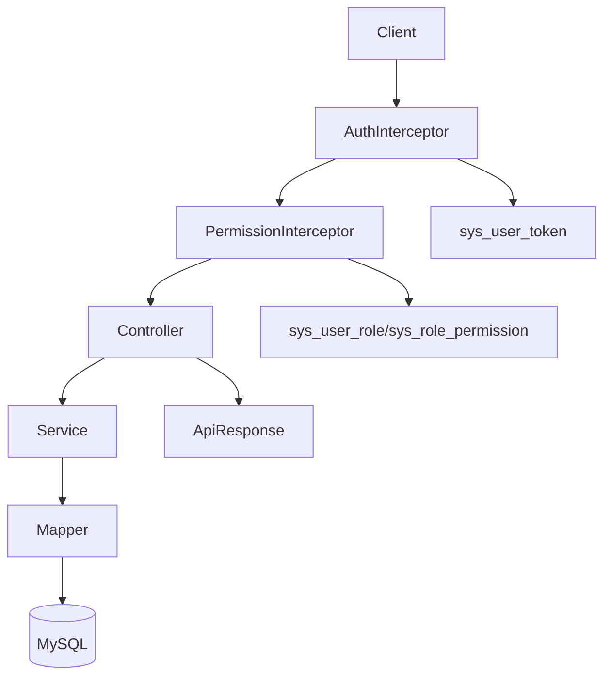
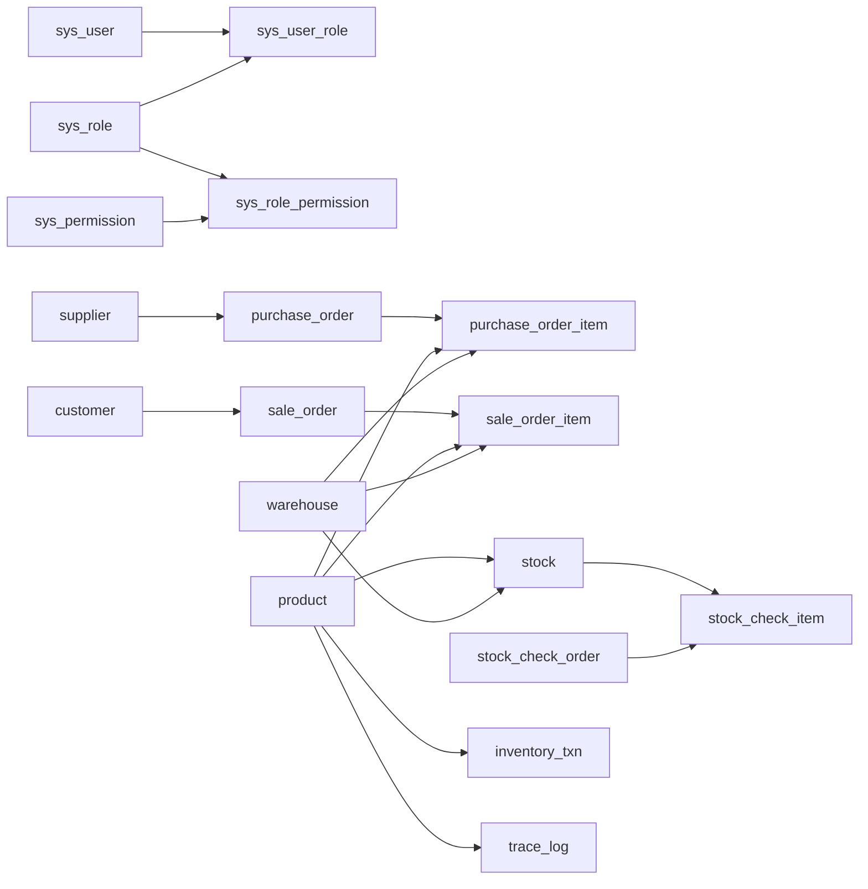
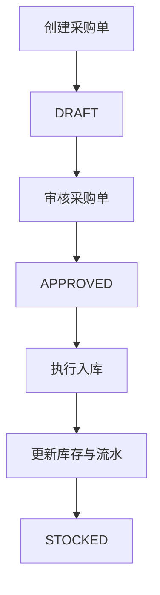
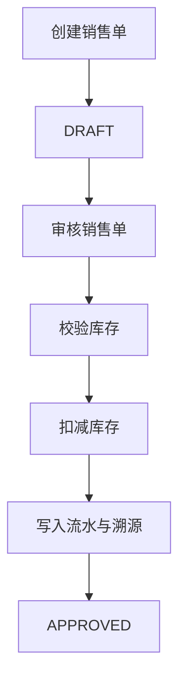
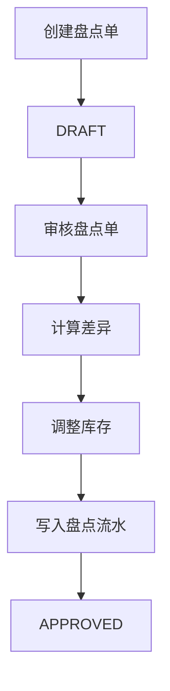

# 饰品进销存系统第二轮优化说明

## 1. 优化背景

在第一轮开发与联调完成后，系统已实现采购、库存、销售、盘点、溯源与报表等核心业务闭环。为了进一步提升系统的可维护性、可测试性、可演示性和论文支撑能力，本轮对代码结构、查询能力、安全体验、测试覆盖和设计说明材料进行了集中优化。

本轮优化主要围绕以下四个方向展开：
- 第二轮异常场景联测与自动化测试补充
- 查询能力增强
- 架构与论文材料补强
- 代码级质量优化

## 2. 本轮已完成的代码优化

### 2.1 状态与业务类型枚举化

为降低硬编码字符串带来的维护风险，将核心业务状态和业务类型提取为统一枚举：
- `DocumentStatus`
- `InventoryTxnType`
- `TraceType`
- `SourceType`

优化收益：
- 避免 `DRAFT`、`APPROVED`、`STOCKED` 等状态值分散在多个类中
- 降低拼写错误导致的隐性 bug 风险
- 提升业务语义清晰度

### 2.2 统一分页能力

新增通用分页基础类：
- `PageQuery`
- `PageUtils`

并将以下列表能力升级为“筛选 + 分页”模式：
- 商品列表
- 库存列表
- 低库存列表
- 采购单列表
- 销售单列表

优化收益：
- 解决全量查询不适合后续数据增长的问题
- 提升接口可用性，便于二次联调与前端接入

### 2.3 查询能力增强

本轮新增或增强的查询条件包括：

#### 商品列表查询
- 按商品编码筛选
- 按商品名称筛选
- 按证书号筛选
- 按状态筛选
- 支持分页

#### 库存列表查询
- 按商品编码筛选
- 按商品名称筛选
- 按批次号筛选
- 按证书号筛选
- 支持分页
- 支持低库存查询

#### 采购单列表查询
- 按采购单号筛选
- 按状态筛选
- 按证书号筛选
- 按日期范围筛选
- 支持分页

#### 销售单列表查询
- 按销售单号筛选
- 按状态筛选
- 按证书号筛选
- 按日期范围筛选
- 支持分页

### 2.4 低库存独立接口

新增独立低库存查询接口，便于演示库存预警能力：
- `GET /api/master/stocks/low`

优化收益：
- 演示时更直观
- 后续可直接扩展为预警中心或补货建议接口

### 2.5 报表时间范围统计

为统计模块新增时间范围查询参数：
- `startDate`
- `endDate`

当前已支持时间范围控制的报表包括：
- 仪表盘统计
- 周转率分析

优化收益：
- 可按月、按周、按指定时间段出具统计结果
- 更符合毕业设计中“统计分析模块”的描述要求

### 2.6 更严格的事务控制

将采购、销售、盘点等关键业务方法统一增强为：
- `@Transactional(rollbackFor = Exception.class)`

优化收益：
- 任何运行时异常或受检异常都可触发事务回滚
- 进一步保证采购入库、销售出库、盘点调整的数据一致性

### 2.7 Swagger 全局 Bearer 鉴权优化

为 OpenAPI 增加了全局 Bearer 鉴权配置，使 Swagger UI 可以统一设置 token，不必每次手动在接口中补请求头。

优化收益：
- 提升联调效率
- 改善演示体验
- 更接近实际后端接口调试流程

### 2.8 初始化密码加密

将种子数据中的默认管理员密码从明文改为加密形式存储，避免初始化脚本直接暴露原始密码。

优化收益：
- 提升数据库初始数据安全性
- 更符合真实系统的密码存储习惯

### 2.9 索引补强

本轮对数据库新增或补强了以下索引：
- `idx_purchase_status_created`
- `idx_sale_status_created`
- `idx_stock_certificate`
- `idx_product_certificate`

优化收益：
- 提升按状态、时间范围、证书号等高频条件的查询效率
- 为统计分析、低库存查询和溯源查询提供更稳定的性能支撑

## 3. 异常场景联测与自动化测试优化

为降低二次修改后的回归风险，本轮新增了服务层自动化测试，重点覆盖以下异常场景：

- 重复商品编码拦截
- 重复证书号拦截
- 草稿单之外禁止重复审核
- 非审核通过采购单禁止入库
- 销售库存不足时禁止出库

### 3.1 已补充的测试文件

- `MasterDataServiceImplTest`
- `PurchaseServiceImplTest`
- `SalesServiceImplTest`

### 3.2 异常测试覆盖点

| 测试编号 | 测试场景 | 预期结果 |
| --- | --- | --- |
| T01 | 创建商品时商品编码重复 | 返回“商品编码已存在” |
| T02 | 创建商品时证书号重复 | 返回“证书号已存在” |
| T03 | 已审核采购单再次审核 | 返回“仅草稿单可审核” |
| T04 | 已入库采购单再次入库 | 返回“仅审核通过的采购单可入库” |
| T05 | 销售出库数量大于库存数量 | 返回“库存不足” |

### 3.3 推荐继续手工联测的异常场景

以下场景已具备手工联测条件，建议你在答辩前再补一轮记录截图：
- 无 token 访问受保护接口
- 错误 token 访问接口
- 无权限用户访问受限接口
- 盘点单重复审核
- 销售单重复审核

## 4. 接口优化说明

本轮对部分接口的入参与能力进行了增强。

### 4.1 商品与库存查询接口

- `GET /api/master/products`
  - 新增查询参数：`pageNo`、`pageSize`、`productCode`、`productName`、`certificateNo`、`status`

- `GET /api/master/stocks`
  - 新增查询参数：`pageNo`、`pageSize`、`productCode`、`productName`、`batchNo`、`certificateNo`

- `GET /api/master/stocks/low`
  - 新增低库存独立查询接口

### 4.2 采购与销售列表接口

- `GET /api/purchases`
  - 新增查询参数：`pageNo`、`pageSize`、`orderNo`、`status`、`certificateNo`、`startDate`、`endDate`

- `GET /api/sales`
  - 新增查询参数：`pageNo`、`pageSize`、`orderNo`、`status`、`certificateNo`、`startDate`、`endDate`

### 4.3 报表接口

- `GET /api/reports/dashboard`
  - 新增：`startDate`、`endDate`

- `GET /api/reports/turnover`
  - 新增：`startDate`、`endDate`

## 5. 数据字典补充说明

本轮优化没有改变核心表的业务职责，但增强了索引和查询用途。核心数据字典简述如下。

| 表名 | 作用 |
| --- | --- |
| `sys_user` | 用户信息 |
| `sys_role` | 角色信息 |
| `sys_permission` | 权限点信息 |
| `sys_user_role` | 用户角色关系 |
| `sys_role_permission` | 角色权限关系 |
| `sys_user_token` | 登录令牌 |
| `sys_operate_log` | 操作日志 |
| `material_dict` | 材质字典 |
| `product_category` | 商品分类 |
| `supplier` | 供应商 |
| `customer` | 客户 |
| `warehouse` | 仓库 |
| `product` | 商品档案 |
| `stock` | 当前库存余额 |
| `purchase_order` | 采购单主表 |
| `purchase_order_item` | 采购单明细 |
| `sale_order` | 销售单主表 |
| `sale_order_item` | 销售单明细 |
| `stock_check_order` | 盘点单主表 |
| `stock_check_item` | 盘点单明细 |
| `inventory_txn` | 库存流水 |
| `trace_log` | 业务溯源日志 |

## 6. 架构与流程图补充

### 6.1 系统架构图



### 6.2 E-R 核心关系图



### 6.3 采购流程图



### 6.4 销售流程图



### 6.5 盘点流程图



## 7. 本轮优化后的收益总结

经过本轮优化，系统相比第一版具备了以下提升：

- 业务状态和关键类型更加规范，减少硬编码
- 查询能力更强，更适合演示和后续前端接入
- 支持低库存独立查询，库存预警更直观
- 报表具备时间范围筛选能力
- Swagger 调试体验更友好
- 默认初始化密码安全性提升
- 异常场景测试得到补强，回归风险降低
- 索引设计更适合答辩和论文中“性能优化”部分描述

## 8. 仍可继续优化的方向

本轮完成的是第二阶段高价值优化，后续仍可继续完善以下内容：

- 列表查询改造为数据库级分页，降低大数据量下的内存压力
- 支持采购单、销售单、盘点单的作废和反审核
- 引入更正规的 JWT 或会话失效机制
- 引入乐观锁或条件更新机制增强并发扣减库存安全性
- 扩展报表：采购排行、销售排行、库存周转明细、月趋势图
- 对操作日志增加变更前后数据快照
- 增强 Swagger 文档示例与统一错误码说明

## 9. 本轮涉及的主要文件

- `backend/src/main/java/com/jewelry/pims/common/PageQuery.java`
- `backend/src/main/java/com/jewelry/pims/common/PageUtils.java`
- `backend/src/main/java/com/jewelry/pims/common/DocumentStatus.java`
- `backend/src/main/java/com/jewelry/pims/common/InventoryTxnType.java`
- `backend/src/main/java/com/jewelry/pims/common/TraceType.java`
- `backend/src/main/java/com/jewelry/pims/common/SourceType.java`
- `backend/src/main/java/com/jewelry/pims/service/impl/MasterDataServiceImpl.java`
- `backend/src/main/java/com/jewelry/pims/service/impl/PurchaseServiceImpl.java`
- `backend/src/main/java/com/jewelry/pims/service/impl/SalesServiceImpl.java`
- `backend/src/main/java/com/jewelry/pims/service/impl/InventoryServiceImpl.java`
- `backend/src/main/java/com/jewelry/pims/service/impl/ReportServiceImpl.java`
- `backend/src/main/java/com/jewelry/pims/config/OpenApiConfig.java`
- `backend/sql/schema.sql`
- `backend/sql/seed.sql`
- `backend/src/test/java/com/jewelry/pims/MasterDataServiceImplTest.java`
- `backend/src/test/java/com/jewelry/pims/PurchaseServiceImplTest.java`
- `backend/src/test/java/com/jewelry/pims/SalesServiceImplTest.java`

## 10. 验证说明

本轮优化完成后，已通过静态检查确认未出现 IDE 级 linter 报错。由于当前环境中缺少可直接调用的 Maven 命令，本轮未在本次会话内完成最终的命令行编译验证，建议你在本地开发环境中执行以下命令做最终确认：

```bash
mvn test
```

如果需要，我下一步可以继续帮你把这份文档再改成更适合毕业论文正文的章节格式，例如：
- `4.4 系统优化设计`
- `5.4 系统测试与优化`
- `6.1 系统不足与改进方向`
